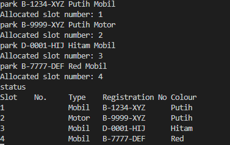
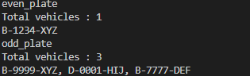
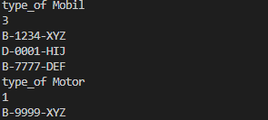

# System Parking Management Using .NET

## Table of Contents
1. [Background](#background)
2. [Usage](#usage)
3. [Features](#features)
    - [Check In](#check-in)
    - [Check Out](#check-out)
    - [Report](#report)
4. [Project Structure](#project-structure)
    - [ParkingSystem](#parkingsystem)
5. [Example Output](#example-output)

## Background
This system is designed to manage, track, and generate reports about vehicle parking. 
It uses lot system, each lot can contain one car or one motorcycle, and one person only have one lot.

## Usage
```
dotnet build

dotnet run
```

## Features
### Check In
- All vehicles can use available lot
- Only car and motorcycle that can used it
- Each vehicle that used the lot will be tracked the plate number/registration number
- Cost of the parking is based on per hour. Immediately affect from first hour.

### Check out
- Lot can be used again by another vehicle if the earlier vehicle already left the lot

### Report 
- Report of filled lot
- Report of available lot
- Report based odd and even registration number
- Report based on color of vehicle
- Report based on type of vehicle

## Project Structure
The project is structured into multiple namespaces, classes.

```
ParkingSystem
├── Program.cs
├── Models
│   ├── Vehicle.cs
│   ├── ParkingSlot.cs
├── Services
│   ├── EmptyParking.cs
│   ├── ManageParking.cs
└── Documentation.MD
```
### ParkingSystem

#### `Program`
This is main class that initiates the project.
    - `Main(string[] args)`: The only route of the application. Creates instance of `ManageParking` and initiates the parking system.

### Models

#### `Vehicle`
```c#
namespace ParkingSystem.Models 

{
    // Class for entity Vehicle (Car & Motorcycle)
    public class Vehicle {
        public string Type { get; set; }
        public string VehicleColor { get; set; }
        public string PlateNumber { get; set; }

        // Constructor for this class
        public Vehicle(string type, string vehicleColor, string plateNumber) {
            this.Type = type;
            this.VehicleColor = vehicleColor;
            this.PlateNumber = plateNumber;
        }
    }
}
```
- **Properties**:
  - `Type` (string): The type of the vehicle (Car & Motorcycle).
  - `VehicleColor` (string): The color of the vehicle.
  - `PlateNumber` (string): The plate number of the vehicle.
- **Constructor**:
  - `Vehicle(string type, string vehicleColor, string plateNumber)`: Initializes a new instance of the `Vehicle` class with the specified type, color, and plate number.

#### `ParkingSlot`
```c#
namespace ParkingSystem.Models 
{
    // Class for slot of parking, contain available slot and vehicle that using it
    public class ParkingSlot {
        public int AvailableNumSlot { get; set; }
        public Vehicle? Vehicle { get; set; }

        // Constructor
        public ParkingSlot(int availableNumSlot) {
            this.AvailableNumSlot = availableNumSlot;
            this.Vehicle = null;
        }

        // Method to check availability parking slot
        public bool IsAvailable() {
            return Vehicle == null;
        }

        public void IsLeave() {
            Vehicle = null;
        }
    }
}
```
- Represents a parking slot which may be available or occupied by a vehicle.
- **Properties**:
  - `AvailableNumSlot` (int): The slot number.
  - `Vehicle` (Vehicle?): The vehicle currently occupying the slot, can be null.
- **Constructor**:
  - `ParkingSlot(int availableNumSlot)`: Initializes a new instance of the `ParkingSlot` class with the specified slot number.
- **Methods**:
  - `IsAvailable()`: Checks if the slot is available.
  - `IsLeave()`: Marks the slot as available by removing the occupying vehicle.

  ### Services
  
  #### `EmptyParking`
  - Manages how the Parking System Work, where the feature reside.
- **Properties**:
  - `List<ParkingSlot>`: A list of parking slots.
- **Constructor**:
  - `EmptyParking(int numSlots)`: Initializes a new instance of the `EmptyParking` class with the specified number of slots.
- **Methods**:

  - `Park(Vehicle vehicle, out int allocatedSlot)`: Attempts to park a vehicle in an available slot/allocate slot.
    ```c#
    // Method to park the vehicle/occupy the slot/lot
            public bool Park(Vehicle vehicle, out int allocatedSlot) {
                foreach (var slot in parkingSlots) {
                    if (slot.IsAvailable()) {
                        slot.Vehicle = vehicle;
                        allocatedSlot = slot.AvailableNumSlot;
                        return true; // Meaning the vehicle park successfully
                    }
                }
                
                allocatedSlot = -1;
                return false;
            }
    ```
  - `Status()`: Generates a report of the current status of all parking slots.
    ```c#
        // Method to generate report
        public void Status() {
            Console.WriteLine("Slot\tNo.\tType\tRegistration No\tColour");

            foreach (var slot in parkingSlots) {
                if (!slot.IsAvailable()) {
                    var vehicle = slot.Vehicle;
                    Console.WriteLine($"{slot.AvailableNumSlot}\t\t{vehicle.Type}\t{vehicle.PlateNumber}\t{vehicle.VehicleColor}");
                }
            }
        }
        ```
  - `OddOrEven(bool isOdd)`: Generates a report of vehicles with odd or even registration numbers.
    ```c#
        // Method to check the plate/registration number odd / even
        public void OddOrEven(bool isOdd) {
            
            var vehicleOdd = new List<String>();
            var vehicleEven = new List<String>();

            foreach (var slot in parkingSlots) {
                if (slot.Vehicle != null) {

                    // Split the Registration Number Format (Ex : ["H", "1234", "XCH"])
                    var parts = slot.Vehicle.PlateNumber.Split('-');
                    if (parts.Length > 1 && parts[1].Length > 0 && char.IsDigit(parts[1][0])) {
                        int num = parts[1][3] - '0';

                        if (num % 2 == 1) {
                            vehicleOdd.Add(slot.Vehicle.PlateNumber);
                        } else if (num % 2 == 0) {
                            vehicleEven.Add(slot.Vehicle.PlateNumber);

                        }
                    }
                }
            }

            if (isOdd == true) {
                Console.WriteLine($"Total vehicles : {vehicleOdd.Count}");
                Console.WriteLine(String.Join(", ", vehicleOdd));
            } else {
                Console.WriteLine($"Total vehicles : {vehicleEven.Count}");
                Console.WriteLine(String.Join(", ", vehicleEven));
            }
        }
    ```
  - `CountFilledLot()`: Generates a report of filled parking slots.
    ```c#
          // Method to show Parking Lot that have been filled
        public void CountFilledLot() {
            var vehicleParked = new List<Vehicle>();

            foreach(var slot in parkingSlots) {
                if (slot.Vehicle != null) {
                    vehicleParked.Add(slot.Vehicle);
                }
            }

            if (vehicleParked.Count > 0) {
                Console.WriteLine("Vehicle Parked : ");
                foreach (var vhc in vehicleParked) {
                    Console.WriteLine($"{vhc.PlateNumber}");
                }
                
                Console.WriteLine($"Total Vehicle Parked : {vehicleParked.Count}");
            } else {
                Console.WriteLine("No Vehicle Parked");
            }
        }
    ```
  - `showEmptyLot()`: Generates a report of available parking slots.
    ```c#
            // Method to show available lot
        public void showEmptyLot() {
            var emptyLot = new List<int>();

            foreach (var slot in parkingSlots) {
                if (slot.Vehicle == null) {
                    emptyLot.Add(slot.AvailableNumSlot);
                }
                
            }

            Console.WriteLine($"Total Available Lot : {emptyLot.Count}");
            foreach (var lot in emptyLot) {
                Console.WriteLine(lot);
            }
        }

    ```
  - `showType(string vehicleType)`: Generates a report of parking slots occupied by a specific type of vehicle.
    ```c#
            // Method to show vehicle and lot based on type
        public void showType(string vehicleType) {
            var car = new List<Vehicle>();
            var motor = new List<Vehicle>();

            foreach(var slot in parkingSlots) {
                if (slot.Vehicle != null) {
                    if (slot.Vehicle.Type == "Mobil") {
                        car.Add(slot.Vehicle);
                    } else {
                        motor.Add(slot.Vehicle);
                    }
                }
            }

            if (vehicleType == "Mobil") {
                Console.WriteLine(car.Count);
                foreach(var vhc in car) {
                    Console.WriteLine(vhc.PlateNumber);
                }
            } else {
                Console.WriteLine(motor.Count);
                foreach(var vhc in motor) {
                    Console.WriteLine(vhc.PlateNumber);
                }
            }
        }
    ```
  - `showLotByColor(string color)`: Generates a report of parking slots occupied by vehicles of a specific color.
    ```c#
            // Method to show lot based on vehicle color
        public void showLotByColor(string color) {
            var colorVehicle = new List<ParkingSlot>();

            foreach(var detail in parkingSlots) {
                if (detail.Vehicle != null) {
                    if (detail.Vehicle.VehicleColor == color) {
                        Console.WriteLine(detail.AvailableNumSlot);
                    }
                }
            }
        }
    ```
  - `Leave(int lotNum)`: Frees up a parking slot when a vehicle leaves.
    ```c#
            // Method to handle when vehicle leave parking lot
        public void Leave(int lotNum) {
            var leftLot = parkingSlots.Find(slot => slot.AvailableNumSlot == lotNum);
            if (leftLot != null) {
                leftLot.IsLeave();
                Console.WriteLine($"Slot number {lotNum} is free");
            } else {
                Console.WriteLine("Cannot find the vehicle");
            }
        }
    ```

#### `ManageParking`
  - This class is the place for user input, including handling the switch
- **Methods**:
  - `ParkInitiate()`: Main method to run the parking management logic and process user commands.

## `Example Output`





